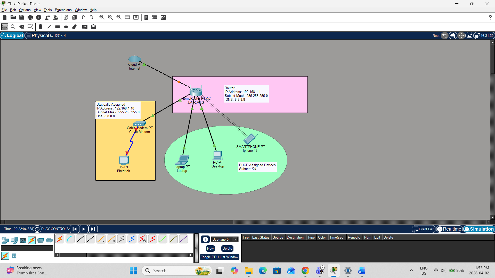

# 🏠 Home Network Documentation

## 📌 Overview
This document provides complete documentation of my home network, including physical and logical topology, IP addressing, devices, configurations, and credential management practices.

The network is designed for a common room environment, supporting internet access, wireless connectivity, and secure communication between devices.

---

## 🌐 1. Physical Topology

The physical topology represents how devices are physically connected.

### 📍 Devices:
- ISP Modem
- Wireless Router (Main Router)
- Laptop (WiFi)
- Smartphone (WiFi)
- Smart TV (WiFi)
- Desktop PC (Ethernet)

### 🔗 Connection Layout:
- ISP → Modem → Router
- Router → Desktop (via Ethernet cable)
- Router → All other devices (via WiFi)

---

## 🧠 2. Logical Topology

The logical topology shows how data flows in the network.

- Type: **Star Topology**
- Router acts as central device
- All devices communicate through router
- DHCP enabled for automatic IP assignment

---

## 📊 3. Addressing Documentation

| Device         | IP Address     | Subnet Mask     | Default Gateway | DNS Server      |
|----------------|----------------|-----------------|-----------------|-----------------|
| Router         | 192.168.1.1    | 255.255.255.0   | N/A             | 8.8.8.8         |
| Desktop PC     | 192.168.1.10   | 255.255.255.0   | 192.168.1.1     | 8.8.8.8         |
| Laptop         | DHCP           | DHCP            | 192.168.1.1     | 8.8.8.8         |
| Smartphone     | DHCP           | DHCP            | 192.168.1.1     | 8.8.8.8         |
| Smart TV       | DHCP           | DHCP            | 192.168.1.1     | 8.8.8.8         |

---

## 🖥️ 4. Network Devices and Services

### 🔧 Devices:
- **Modem** – Provided by ISP for internet access
- **Router** – Handles routing, DHCP, NAT, and WiFi
- **Switch (built-in)** – Used for wired connections

### ⚙️ Services:
- DHCP (Dynamic IP assignment)
- NAT (Network Address Translation)
- DNS (Google DNS: 8.8.8.8)
- WiFi (2.4 GHz / 5 GHz)

---

## ⚙️ 5. Device Configurations

### Router Configuration:
- IP Address: 192.168.1.1
- DHCP Range: 192.168.1.100 – 192.168.1.200
- SSID: Home_Network
- Security: WPA2/WPA3 Personal
- Password: Strong encrypted password

### Desktop Configuration:
- Static IP configured manually
- Connected via Ethernet cable

### Wireless Devices:
- Connected using SSID
- IP assigned automatically via DHCP

---

## 🔐 6. Credential Storage Method

To securely store login credentials, the following method is used:

- Passwords stored in a **password manager**
- Strong passwords (mix of uppercase, lowercase, numbers, symbols)
- No passwords written in plain text
- Two-factor authentication (2FA) enabled where possible

Recommended tools:
- Bitwarden / LastPass

---

## 🖼️ 7. Network Topology Diagram

(Add your image here after uploading)

```markdown

